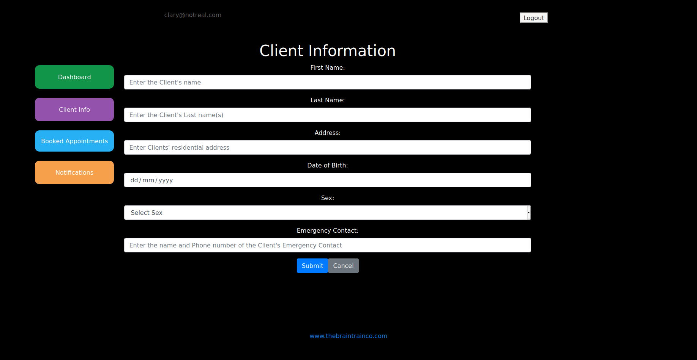

# Register page
The app uses authentication in the form of an email and password. To register, click the 'Register' or 'Sign up' buttons. Enter the email that is used for the patient records and a password in the two remaining fields. When clicking 'Sign Up' the app will log the user in and redirect to the dashboard. The app won't register a user if their email is not found in the patients or users (admins) in the Cliniko API. 

# Login page
When the user is logged out and tries to access the website they are redirected to the login page. Sign in with the credentials that the user has registered with.

If incorrect details are provided 'Invalid email or password' will show.

# Forgot password page
If the user has forgotten their login details they can click 'Forgot password' to redirect to the forgot password page. Once the user enters their email and clicks 'Submit Query' the server will send a password reset email.

# Reset password page
The testing email service Etheral Email (https://ethereal.email/) is used and will receive the messages sent from the server. Copy the link to be redirected to the reset page.

The password reset creates a token that is attached to the users profile and will expire in 2 minutes. The user must enter their email and new password before that time to change it.

If the time expires the 'Token Invalid' message shows.

# Dashboard

Once the user is logged in they are redirected to the Dashboard where they can click links to other pages

# Appointments

On the Appointments page, the user can see there appointment information and be able to make a change request. If such a request is made a ticket is created containing the information.

# Client Info

A user can see their information that is stored on the Cliniko site by accessing this tab. Clicking 'Edit' will redirect to a Edit details page where they can change the details.

# Notifications

The Notifications tab will contain all of the tickets the user has created. If the user is an Admin it will contain all tickets where they can accept, reject or delete tickets

# Using the app

To start the app in the development environment enter into the terminal: 

    yarn start